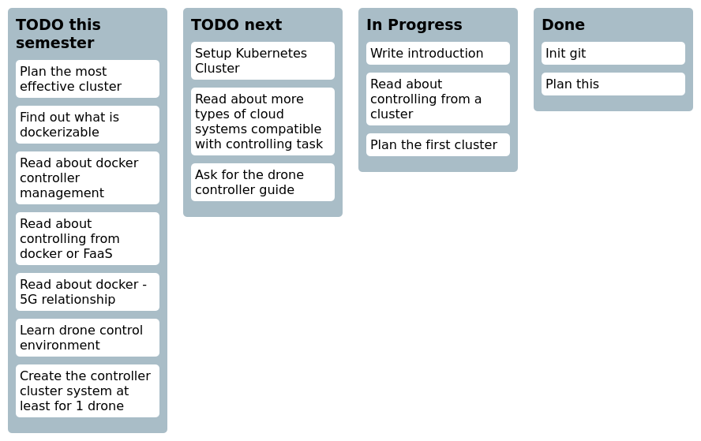

Felhő alapú dróntervezés
----
Dipterv 1 - 2020 tavasz
Nánási Dániel
-------
### Dokumentáció:
docs/thesis.pdf
### Ütemezés:

<!---KANBAN
# TODO this semester
- Plan the most effective cluster
- Find out what is dockerizable
- Read about docker controller management
- Read about controlling from docker or FaaS
- Read about docker - 5G relationship
- Learn drone control environment
- Create the controller cluster system at least for 1 drone

# TODO next
- Setup Kubernetes Cluster
- Read about more types of cloud systems compatible with controlling task
- Ask for the drone controller guide

# In Progress
- Write introduction
- Read about controlling from a cluster
- Plan the first cluster

# Done
- Init git
- Plan this
KANBAN--->

### Első cluster ötlet:

lehetséges queue: kafka? rabbitMQ? activeMQ?
